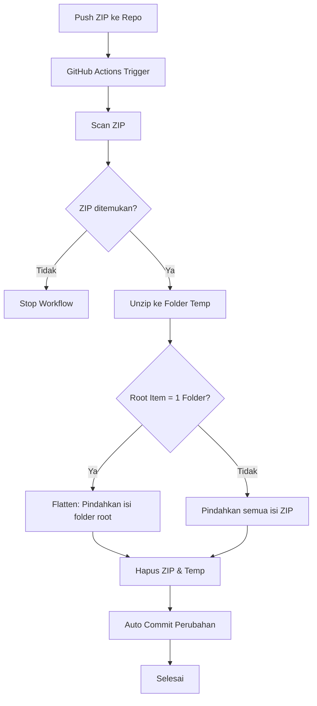

<div align="center">

# 🚀 GitHub Auto Unzip & Flatten  
### *Sistem Otomatis Ekstraksi File ZIP — Dengan Struktur Rapi & Tanpa Folder Pembungkus*

<br/>


<br/><br/>

**Dokumentasi visual lengkap untuk sistem otomatis ekstraksi ZIP  
yang langsung mengeluarkan isi ZIP ke lokasi yang sama tanpa folder tambahan, aman & sangat stabil.**

</div>

---

# 📘 **Daftar Isi**

1. [🎯 Ringkasan Proyek](#-ringkasan-proyek)  
2. [✨ Fitur Utama](#-fitur-utama)  
3. [🧠 Cara Kerja Secara Visual](#-cara-kerja-secara-visual)  
4. [📁 Perbandingan Sebelum & Sesudah](#-perbandingan-sebelum--sesudah)  
5. [🚀 Instalasi & Setup](#-instalasi--setup)  
6. [⚙️ Penjelasan Workflow YAML](#️-penjelasan-workflow-yaml)  
7. [📊 Flowchart Proses Lengkap](#-flowchart-proses-lengkap)  
8. [📦 Struktur Folder Ideal](#-struktur-folder-ideal)  
9. [🧪 Contoh Penggunaan](#-contoh-penggunaan)  
10. [🔍 Troubleshooting](#-troubleshooting)  
11. [💡 Tips & Best Practice](#-tips--best-practice)  
12. [🤝 Kontribusi](#-kontribusi)  
13. [📄 Lisensi](#-lisensi)

---

# 🎯 **Ringkasan Proyek**

> **GitHub Auto Unzip & Flatten** adalah workflow GitHub Actions  
> yang mendeteksi file `.zip`, mengekstraknya secara otomatis,  
> mengeluarkan isi ZIP langsung ke folder ZIP berada, menghapus file ZIP,  
> dan melakukan auto-commit perubahan.

Tidak ada lagi folder berlapis seperti:

```

bank.zip → bank/index.php

```

Sekarang hasilnya langsung:

```

index.php

```

Workflow ini sangat cocok untuk pipeline otomatis, upload data, import project, sistem backup, dan sebagainya.

---

# ✨ **Fitur Utama**

### ✔ Otomatis Extract ZIP  
Setiap push file `.zip`, workflow langsung memprosesnya.

### ✔ Mode “FLATTEN ZIP”  
Isi ZIP langsung keluar ke lokasi ZIP berada → **tanpa folder pembungkus**.

### ✔ Auto Delete ZIP  
ZIP langsung dihapus setelah selesai diproses.

### ✔ Aman & Stabil  
Jika ada ZIP yang rusak → dilewati tanpa menghentikan workflow.

### ✔ Multi ZIP Support  
Support ratusan file ZIP sekaligus dengan stabilitas tinggi.

### ✔ Auto-Commit  
Perubahan otomatis disimpan ke repo.

### ✔ Optimized Performance  
Scanning cepat (maks depth 10), proses satu per satu, error handling kuat.

---

# 🧠 **Cara Kerja Secara Visual**

### 🔹 1. Push ZIP ke repo
```

my-project/
└── bank.zip

```

### 🔹 2. GitHub Actions mendeteksi ZIP  
```

find . -name "*.zip"

```

### 🔹 3. Unzip ke folder sementara  
```

/tmp/tmp12345/bank/...

```

### 🔹 4. Flatten (ambil isi folder root)  
✔ Jika ZIP punya **1 folder root** → ambil isi folder itu  
✔ Jika ZIP punya banyak isi → pindah semua

### 🔹 5. Hapus ZIP & folder temp  
### 🔹 6. Auto commit hasil ekstraksi

---

# 📁 **Perbandingan Sebelum & Sesudah**

### **SEBELUM**

```

bank.zip
└── bank/
├── index.php
├── config.php
└── assets/

```

### **SESUDAH**

```

index.php
config.php
assets/

# bank.zip sudah dihapus

```

---

# 🚀 **Instalasi & Setup**

Buat folder:

```

.github/workflows/

```

Buat file:

```

.github/workflows/auto-unzip-flatten.yml

````

Isi dengan workflow berikut:

---

# ⚙️ **Penjelasan Workflow YAML**

```yaml
name: Auto unzip (flatten) and remove zip files

on:
  push:
    branches:
      - main      # Ganti sesuai branch utama Anda

permissions:
  contents: write

jobs:
  unzip_job:
    runs-on: ubuntu-latest

    steps:
      - name: Checkout repo
        uses: actions/checkout@v4

      - name: Detect, unzip (flatten), and delete ZIP files
        shell: bash
        run: |
          set -uo pipefail

          echo "=== Scan .zip files ==="
          mapfile -t zips < <(find . -maxdepth 10 -type f -name "*.zip" ! -path "./.git/*")

          if [ ${#zips[@]} -eq 0 ]; then
            echo "Tidak ada zip ditemukan."
            exit 0
          fi

          echo "Ditemukan ${#zips[@]} zip."

          shopt -s dotglob nullglob

          for z in "${zips[@]}"; do
            echo
            echo "=== Proses ZIP: $z ==="
            dir=$(dirname "$z")
            tempdir=$(mktemp -d)

            # Unzip ke temp
            if ! unzip -o "$z" -d "$tempdir" >/dev/null; then
              echo "Zip error: $z — dilewati."
              rm -rf "$tempdir"
              continue
            fi

            entries=( "$tempdir"/* )

            if [ ${#entries[@]} -eq 1 ] && [ -d "${entries[0]}" ]; then
              echo "ZIP punya satu folder root (${entries[0]}) → flatten"
              mv "${entries[0]}"/* "$dir"/ || true
            else
              echo "ZIP berisi banyak item → pindahkan semua"
              mv "$tempdir"/* "$dir"/ || true
            fi

            rm -rf "$tempdir"
            rm -f "$z"
          done

      - name: Commit changes (if any)
        uses: stefanzweifel/git-auto-commit-action@v5
        with:
          commit_message: "chore: flatten unzip and remove zip files"
          branch: main
````

---

# 📊 **Flowchart Proses Lengkap**



---

# 📦 **Struktur Folder Ideal**

```
/
├── data.zip
├── uploads/
│    ├── assets.zip
│    └── template.zip
├── src/
│    └── module.zip
└── .github/
     └── workflows/
          └── auto-unzip-flatten.yml
```

Semua ZIP otomatis diproses tanpa konfigurasi tambahan.

---

# 🧪 **Contoh Penggunaan**

### 🔹 Upload ZIP ke repo

Push atau upload melalui GitHub UI.

### 🔹 Workflow otomatis berjalan

Cek di tab **Actions**.

### 🔹 ZIP hilang, isi keluar

Hasil langsung muncul tanpa folder tambahan.

---

# 🔍 **Troubleshooting**

| Masalah                 | Penyebab                    | Solusi                              |
| ----------------------- | --------------------------- | ----------------------------------- |
| ZIP tidak diekstrak     | Ekstensi bukan .zip         | Rename ke `.zip`                    |
| Ada folder “root” tetap | ZIP punya multi folder root | Workflow tidak menghapus multi-root |
| Tidak commit            | Permission kurang           | Pastikan `contents: write`          |
| ZIP corrupt             | Isi rusak                   | Upload ulang ZIP                    |

---

# 💡 **Tips & Best Practice**

* Hindari ZIP dengan banyak subfolder root
* Pastikan ekstensi `.zip` jelas
* Gunakan untuk sistem import otomatis, dataset, archive, dll
* Bisa digabung dengan workflow CI/CD lain
* Bisa dimodifikasi untuk:

  * hanya ekstrak ZIP di folder tertentu
  * hanya untuk file ZIP dengan prefix tertentu
  * manual trigger (`workflow_dispatch`)

---

# 🤝 **Kontribusi**

Pull request sangat terbuka!
Saran fitur baru juga dipersilakan.

---

# 📄 **Lisensi**

Proyek ini dilisensi dengan **MIT License**.
Anda bebas menggunakannya untuk tujuan apapun.

---

<div align="center">

### ✨ Terima kasih telah menggunakan **Auto Unzip & Flatten**

Jika membutuhkan versi custom untuk project Anda → saya siap bantu.

</div>
```

---


